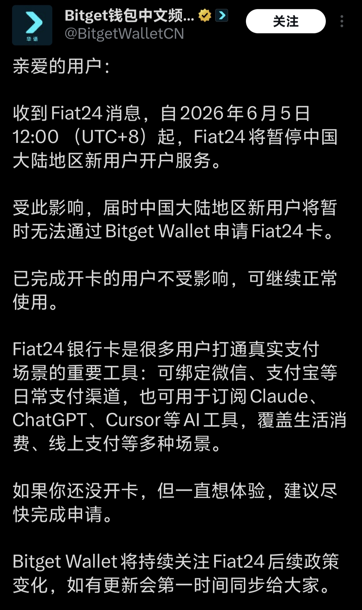

2026 年 6 月 5 日中午 12:00（UTC+8）之后，Fiat24 暂停了中国大陆地区新用户开户服务。Bitget Wallet 中文频道发布的通知显示，受此影响，中国大陆地区新用户将暂时无法通过 Bitget Wallet 申请 Fiat24 卡；已经完成开卡的用户暂不受影响，可以继续正常使用。

这件事对已经开卡和还没开卡的人影响完全不同。

## 发生了什么

Fiat24 是一家受瑞士金融市场监管局 FINMA 监管的金融科技服务商，Bitget Wallet Card、SafePal 等加密钱包卡产品都使用过 Fiat24 的底层服务。

根据截图中的通知，变化主要有三点：

1. 时间点：2026 年 6 月 5 日 12:00（UTC+8）起生效。
2. 影响范围：中国大陆地区的新用户开户申请。
3. 已开户用户：已经完成开卡的用户暂不受影响，可继续正常使用。

换句话说，这不是“所有卡都不能用了”，而是“新用户入口先关了”。如果你已经完成 Fiat24 开户和开卡，当前最重要的是确认卡片、余额、绑定渠道和提现路径都正常。

## 为什么这张卡重要

Fiat24 卡之所以被很多人关注，是因为它把加密资产、法币账户和日常支付连接在了一起。对不少用户来说，它的价值不只是“多一张卡”，而是能把一些原本割裂的支付场景打通：

- 可绑定微信、支付宝、Apple Pay 等日常支付渠道；
- 可用于线上订阅服务，比如 Claude、ChatGPT、Cursor 等 AI 工具；
- 可作为跨境消费、线上支付、备用支付方式；
- 对加密资产用户来说，提供了一条更接近真实消费场景的出入金路径。

这也是为什么“暂停新用户开户”会引起关注。它影响的不是某一个 App 的按钮，而是很多人原本计划中的支付通道。

## 对不同用户的影响

如果你已经开卡，短期内影响相对有限。通知明确说已完成开卡用户不受影响，但我会建议你立刻做一次自查：确认卡片状态、余额、绑定的支付渠道，以及能否正常转出资金。不要等到需要付款时才发现某个环节不可用。

如果你还没开卡，而且人在中国大陆地区，那么目前通过 Bitget Wallet 申请 Fiat24 卡的路径已经暂停。后续是否恢复，要等 Fiat24、Bitget Wallet 或相关钱包方继续发布公告。

如果你依赖这张卡支付订阅服务，最好准备一个备用方案。AI 工具订阅、云服务、域名、服务器、App Store 付款这类场景都不适合只押在一条支付通道上。

## 现在可以做什么

已经开卡的用户，可以优先做四件事：

1. 检查卡片是否仍可正常支付。
2. 确认微信、支付宝、Apple Pay 等绑定是否正常。
3. 小额测试充值、消费或转出路径。
4. 保留至少一个备用支付渠道。

还没开卡的用户，暂时不要把 Fiat24 当成确定可用的新方案。可以继续关注官方公告，但在支付刚需上，应优先准备其他可验证、可持续的替代方式。

## 我的判断

这次变化更像是合规和区域策略收紧，而不是单纯的产品维护。过去几年，加密支付卡一直处在“需求很真实，但合规边界不断变化”的状态。产品可以快速上线，但只要涉及银行卡、KYC、跨境支付和地区准入，稳定性就不完全由钱包 App 决定。

所以对用户来说，最现实的策略不是追逐某一张“神卡”，而是建立支付冗余：主卡、备用卡、钱包余额、交易所出入金、传统银行卡各留一条路。真正稳定的支付体系，从来不该依赖单点。

## 信息来源

- 用户提供的 Bitget Wallet 中文频道截图。
- 吴说报道：SafePal 接 Fiat24 通知，自 2026 年 6 月 5 日起暂停中国大陆地区新用户开户申请，并提到 Bitget Wallet 等同样使用 Fiat24 服务的钱包也会受影响。
- Foresight News 对 Fiat24 暂停大陆用户申请事件的后续报道。
